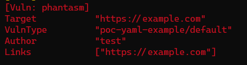

# 快速开始

我们拿访问example.com并匹配他的title来举例，首先我们需要准备一个POC文件，POC文件是一个yaml文件，包含了请求的信息和匹配的表达式，下面是一个简单的POC文件：

**POC:**
```yaml
name: poc-yaml-example
transport: http
rules:
  r0:
    request:
      method: GET
      path: /
    expression: response.status == 200 && response.title.bcontains(b"Example Domain")
expression: r0()
detail:
  author: test
  links:
    - https://example.com
```
## 如何使用 POC

将上述POC保存为example.yml，假定与xray可执行文件存放于同一目录下，可执行如下命令：

```shell
./xray ws --poc example.yml --url http://127.0.0.1:8080
```


## 如何调试 POC

如果 poc 无法扫出期望的结果，可以按照以下思路调试

- 确定 poc 语法正确，payload 正确。
- 在配置文件 `http` 段中加入 `proxy: "http://proxy:port"`，比如设置 burpsuite 为代理，这样 poc 发送的请求可以在 burp 中看到，看是否是期望的样子。

[//]: # (TODO：添加Burp发包截图)