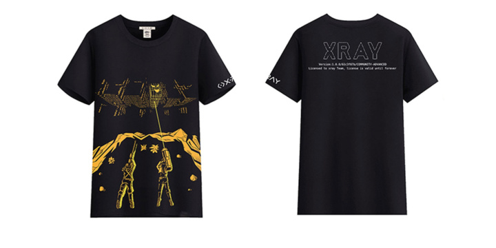

提交 poc ，即可获得与 xray 社区版内部大佬技术切磋交流的机会。提交 PR 过程中会有内部大佬审核，帮助改进 poc 的实现，共同进步。同时，为了感谢提交 poc 的同学的辛苦付出, 我们准备了一份厚礼:

奖品名称 | POC 数量 | 实例图片
---- | :----: | :----:
xray 文化衫 | 1  | 
xray常用命令大型鼠标垫 | 1 | 
xray 定制键帽 (随机字母) | 1 | 制作中
[pwnhub](https://pwnhub.cn/index) 邀请码 | 3 | 
xray 高级版（一个季度) | 1 | [高级版对比](generic/compare.md)
xray 高级版（一年) | 3 | [高级版对比](generic/compare.md)
ikbc/akko 键盘(87键) | 5 | 
filco 键盘 (87键) | 9 | 

## **备注**：

+ 提交一个 poc 即可进入 xray 核心贡献者群，群内经常讨论安全热点，且能与大佬们面对面交流
+ 对于 xray 高级版年费用户（3个 POC 兑换者），在当年的高级版授权有效期内，只需在提交一个即可续一年，但只能续一年，不可叠加。
  + 举个例子，小明写了 3 个 POC 后兑换了一个高级版，然后又写了 1 个 POC，此时高级版有效期就变为了2年，但在今年的有效期内写再多也不会再增加年限了，但明年可以再写一个继续续一年。
+ poc 数量可累计，兑换一个礼品后相应减去对应poc数量。
+ 集齐 xray 收藏键帽可获得 chaitin 惊喜礼品。
