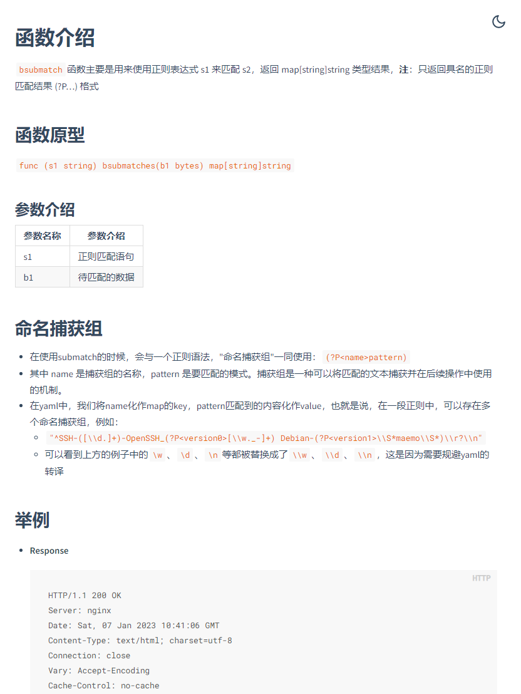

# 文档使用方法

欢迎阅读我们的文档！本文档将指导您了解如何有效地使用我们的文档以便快速上手。
## 导航和跳转

本文档的目录结构清晰，您可以在左侧目录栏查看所有可用的章节和小节。点击相应的章节或小节标题，即可快速跳转到您想要查看的内容。例如，如果您想了解YAML插件的参数类型与函数，可以直接点击“附录”下的
- [**YAML插件的参数类型与函数**](/guide/yaml/yaml_type_func.md)

## 代码示例

本文档包含许多代码示例，以帮助您更好地理解各种功能和用法。您可以直接复制这些代码示例，然后在您的环境中运行，以便更好地理解这些示例。
- [**POC编写模板**](/guide/yaml/yaml_poc_template.md)
- [**指纹编写模板**](/guide/yaml/yaml_finger_template.md)

## 类型与函数

此处包含了全部的类型与函数，您可以在编写YAML遇到使用问题时进行查看
- [**YAML插件的参数类型与函数**](/guide/yaml/yaml_type_func.md)

点击函数后面的🔎即可查看函数详情，使用案例：

## 文档反馈

我们非常重视您的反馈。如果您在阅读过程中发现文档存在错误、遗漏或不清晰的地方，可以前往

[**xray_document**](https://github.com/chaitin/xray_document)

提issue，我们会及时的进行处理。您的反馈将帮助我们改进文档，为所有用户提供更好的阅读体验。

祝您学习愉快！希望本文档能为您提供所需的帮助，助您更好地掌握开发插件的相关知识和技能。如有任何疑问或建议，请随时与我们联系，我们将竭诚为您提供支持。