## 前言

从有Rad开始就一直在使用，从开始使用便非常的惊喜，并在使用过程中产生了很多Rad的使用小技巧，一些官方描述不太清晰或者很少提及的地方我也在与开发者的请教中明了，所以希望借此文章将一些使用技巧分享给大家。

## 一、Rad是什么？

rad，全名 `Radium`，名字来源于放射性元素——镭, 从一个URL开始，辐射到一整个站点空间。他是从企业版xray中提取出的一款专为安全扫描而生的浏览器爬虫。由Golang写成，具有如下特点：

- 通过调用Chrome，可以智能爬取各种 Web2.0 网站，模拟人的行为进行点击、输入等，自动事件触发和表单填充，助力漏洞扫描更快一步
- 支持Windows，Linux，MacOS（包括M1芯片版）
- 支持手动登录网站后继续爬取
- 支持在爬取过程中对相似度高的页面进行去重，过滤静态文件、重复请求减少资源消耗
- 支持自由配置代理，UA等设置
- 支持为指定域名配置headers
- 支持多种输出，可选择输出域名，完整请求，JSON
- 支持自定义请求关键字/正则过滤，防止危险请求触发、意外登出
- 支持自定义并发控制，合理调配资源占用
- 支持自定义行为控制，限制单个页面中点击深度，点击次数、点击时间间隔、超时时间

## 二、安装Rad

#### 下载地址

[https://github.com/chaitin/rad/releases](https://github.com/chaitin/rad/releases)

自行下载对应版本的Rad即可

#### 准备

安装最新版本的Chrome

Rad是没有图形化界面的，所以需要通过Powershell，cmd，shell等通过命令行调用。配置文件需要随意制定一个扫描目标后生成。

执行如下命令获取配置文件：

`rad.exe -t http://example.com`   各自系统命令有所不同

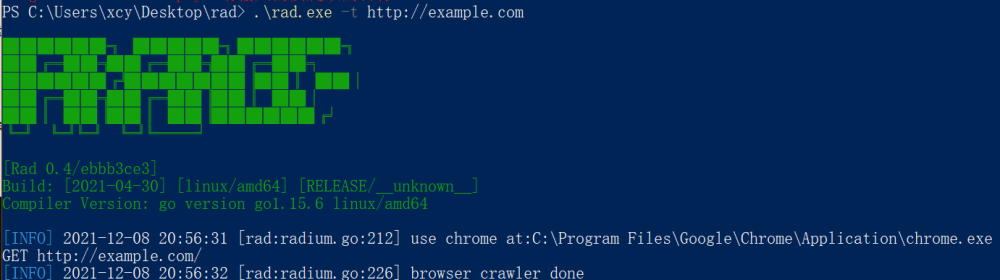

执行完成后应如下图

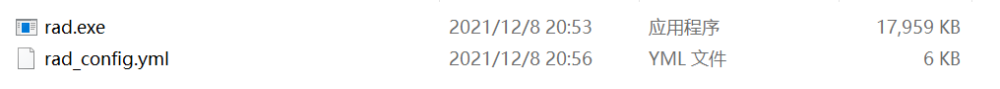

## 三、基础使用

首先使用`rad.exe -h`查看Rad本身自带的帮助信息

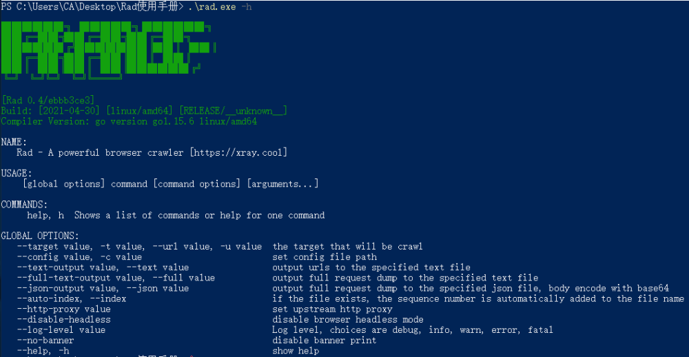

1.  `--target`|`-t`|`--url`|`-u` 
   - 该参数都可以指定扫描目标，作用一样
2.  `--config`|`-c` 
   - 该参数可指定使用哪个配置文件，当未使用该参数时默认rad_config.yml
3.  `--text-output`|`--text` 
   - 指定输出模式为txt，且将导出基本结果，也就是只有请求类型与请求地址。
   - 输入结果如图：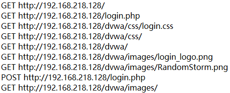
4. `--full-text-output`|`--full` 
   - 指定输出模式为txt，且将导出完整请求，也就是包括了请求头与请求体。
   - 输入结果如下图：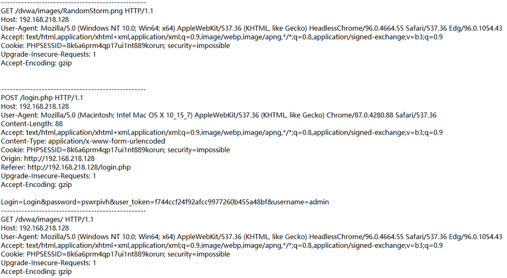
   
5. `--json-output`|`--json` 
6. 指定输出模式为json，且将导出完整请求，也就是包括了请求头与请求体。
7. 输出结果如下图：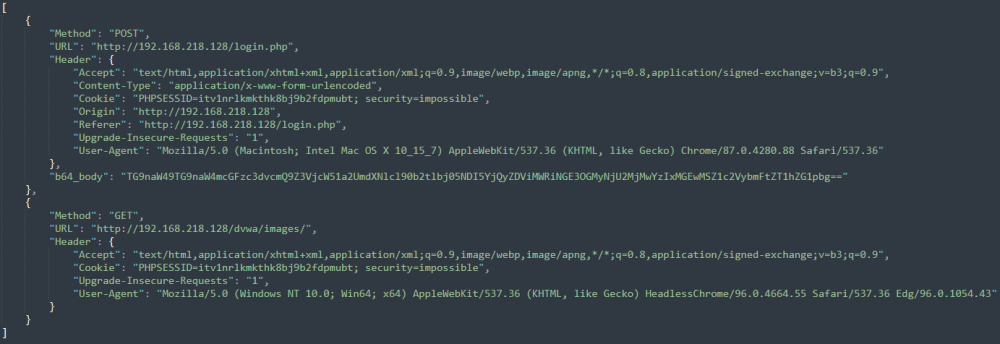
8. `--auto-index`|`--index` 
9. 该参数需配合结果输出参数一起使用，他会检测到如果当前生成的结果文件已存在，便自动在结果文件的名称后面添加编号，不需要自己再修改生成文件的名称。
10. 效果如图：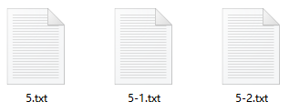
11. `--http-proxy` 
12. 设置代理服务器，需要注意，此处的原理为：Rad为调用起的Chrome设置了代理，而不是Rad本身使用代理。
13. `--disable-headless` 
14. 无头模式，又称为无界面启动，是指在调用Chrome做爬虫时不打开浏览器，而是使用浏览器的内核进行爬虫
15. Rad在默认状态下是启用无头模式的，使用此参数可禁用无头模式，使其开启浏览器运行，观测爬取过程
16. 无头模式的默认状态也可以在配置文件中修改
17. `--log-level` 
18. 指定输出等级，默认输出info，当级别高于info后，info将不被输出。
19. 级别分为：`debug, info, warn, error, fatal`
20. 效果如下图：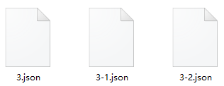
21. `--no-banner` 
22. 去掉banner信息
23. 效果如图：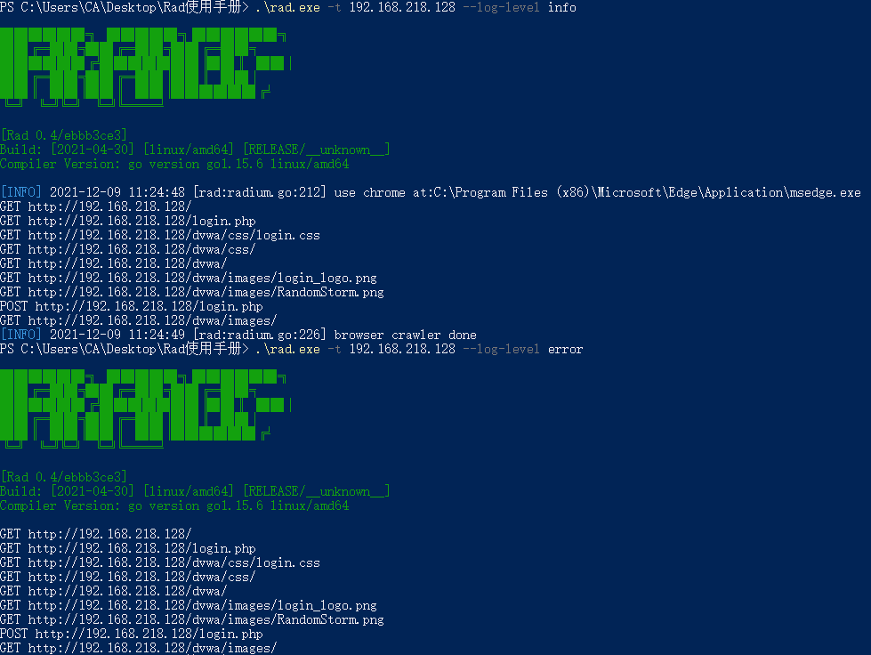
24. `--wait-login` 
25. 使用该参数会自动禁用无头浏览模式，开启一个浏览器供手动登录。 在登录完毕后在命令行界面点击回车键继续爬取。注意需要登陆时请在配置文件中开启图片显示功能，否则会出现验证码不显示的现象
26. 以下为登陆全流程
27. 首先会开启一个空白界面，需要手动在地址栏输入要登陆的地址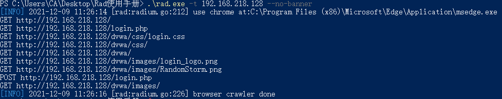
28. 响应完成后输入账号密码进行登录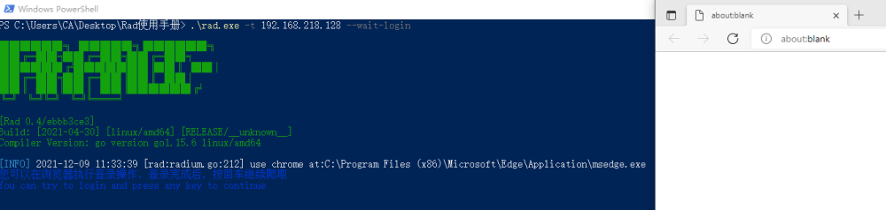
29. 登陆完成后进入主界面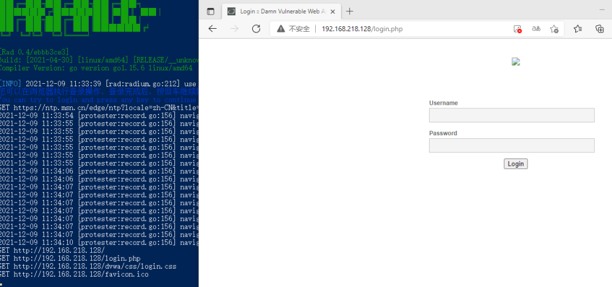
30. 这个时候回到shell界面点击回车即可继续爬取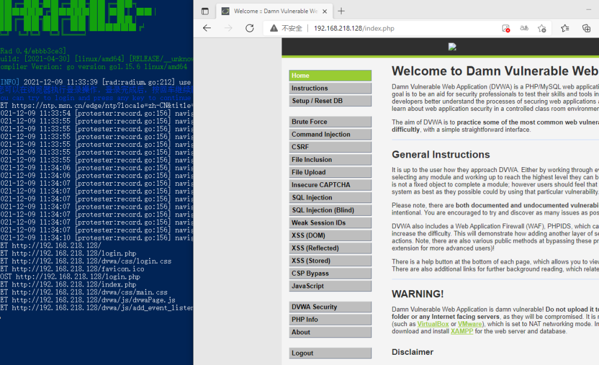

## 四、Rad联动xray等其他工具

Rad与其他工具联动的原理基本一致，这里只选择三个工具作为演示

#### xray

-  社区版：设置上级代理为xray监听地址 首选运行xray： 
   - `xray webscan --listen 127.0.0.1:7777 --html-output proxy.html`
   - 运行rad：`rad -t http://example.com -http-proxy 127.0.0.1:7777`
-  高级版：对 Rad 进行了深度融合，下载后可以一键使用： 
   - `xray webscan --browser-crawler http://example.com --html-output vuln.html`
   - 注意将xray与Rad放于同一目录下

#### Burp Suite

- 使用burp作为上级代理，只需要将bp打开，然后将Rad的http-proxy设置为burp的代理端口即可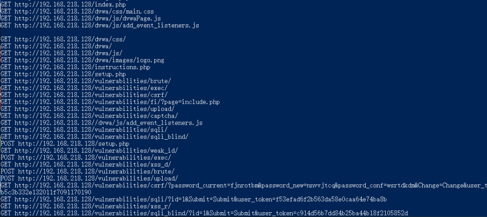

- burp的抓包打开后，就可以直接使rad暂停住，可以修改包的内容再发送。

- 也可以将intercept置为off，在HTTP history中查看发送与返回的数据包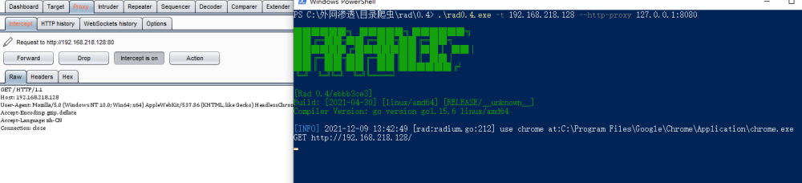

- 如果需要再挂一层代理改变出网ip，只需要在Burp的User options中的Upstream Proxy Servers设置上层代理即可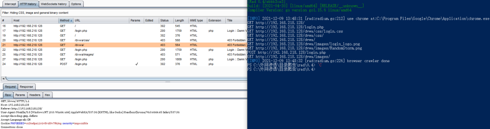

#### W13scan

原理与xray一样，使用W13scan的被动扫描作为上级代理完成联动

- `python3 w13scan.py -s 127.0.0.1:7778 --html # 端口可省略，默认为7778,开启--html即实时生成html报告`
- `rad -t http://example.com -http-proxy 127.0.0.1:7778`

## 五、多目标扫描

由于Rad目前不支持多目标扫描，所以可以选择使用命令行的多命令执行完成多目标扫描的目的。

1.  多条命令之间推荐使用`;`来执行，第一时因为linux的命令行与powershell都支持该符号分割，第二也是可以在上一条命令执行失败的情况下继续执行下一条命令，从而达到出现了问题也不影响后续的效果。 
   - 效果如下图：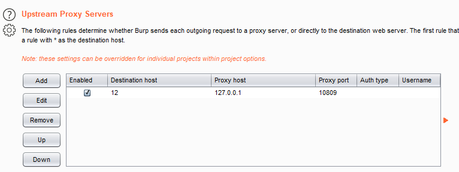

2.  目标少的时候还可以使用这种方式，但如果目标多了，使用脚本来生成命令会更为合适 
   -  如果需要xray+Rad的批量主动扫描，可以使用timwhitez师傅写的脚本来实现。获取地址：[xray-Rad](https://github.com/timwhitez/rad-Xray) 
   -  如果只是生成一段命令，可以参考以下脚本，使用方式：`python 1.py -r a.txt -o b.txt` 
   -  
```python
   import argparse
   import time
   parser = argparse.ArgumentParser()
   txtName = str(int(time.time())) + ".txt"
   parser.add_argument('-r',help='Enter the file you want to generate')
   parser.add_argument('-o', type=str, default=txtName, help='Please enter the name of the file you want to output. Default is '+txtName)
   args = parser.parse_args()
   f = open(args.r,'r')
   data = f.readlines()
   a = ""
   for i in data:
       a += "; .\\rad.exe -t {} --json abs.json --index".format(i.strip())
   f.close()
   f = open(args.o,"w")
   f.write(a)
   f.close()
```
 

   - 这是目标文件：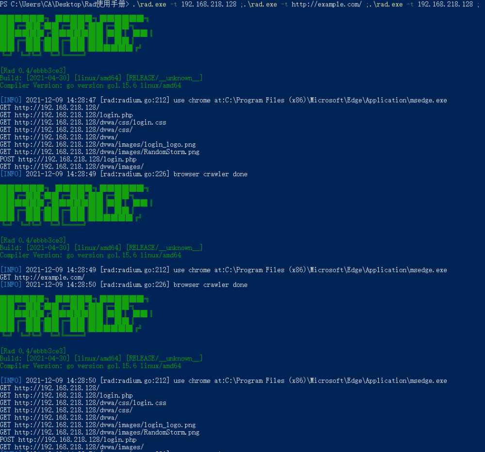

   - 这是生成结果： 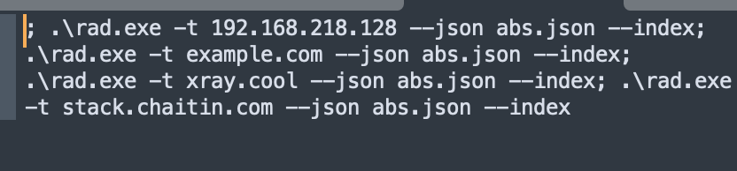

   - 具体想要生成出什么样的命令都可以再修改 

## 六、配置文件解析

此处只对配置文件中描述的比较模糊的地方做一下详细说明，故不粘贴配置文件的全部内容

-  `exec_path: ""` 
   - 启动chrome的路径，正常安装了Chrome的就一般不需要填写
-  `disable_headless: true` 
   - 禁用无头模式，也就是禁用无界面启动。默认为禁用状态，修改为false后运行程序即可看到浏览器
-  `force_sandbox: false` 
   - 强制开启sandbox；为 false 时默认开启沙箱，但在容器中会关闭沙箱。为true时强制启用沙箱，可能导致在docker中无法使用。
   - 沙盒利用操作系统提供的安全性，允许不能对计算机做出持久性改变或者访问持续变化的信息的代码的执行。沙箱提供的架构和具体保证依赖于操作系统。
-  `proxy: ""` 
   - 代理配置，如果不想在命令行中每次都添加，可直接在此处添加
-  
```yaml
domain_headers:                   # 请求头配置:[]{domain,map[headerKey]HeaderValue}
- domain: '*'                     # 为哪些域名设置header，glob语法
  headers: {}                     # 请求头，map[key]value
```
 

   - 该参数可以实现高度的自定义，并且可以设置多个domain，为每个不同的domain设置不同的headers
   - 拿space.bilibili.com来举例，当没有登陆的时候，访问该url会跳转至登陆界面。而当登陆后，该url会跳转至登陆用户的空间。所以如果想要爬取相关内容，又不想使用wait-login，就可以先登录，抓取cookie，然后此处设置cookie，会直接跳转到登录用户的空间
   - 还类似与这个漏洞，CVE-2021-29441，将UA设定成指定的内容，即可未授权访问admin的内容
   - 还有像一些webVPN，通过特定的cookie允许访问内网的内容，正常在没有cookie时无法访问。这个时候就可以对该域名添加指定cookie，从而实现让rad爬取内网资产的目的。
-  `element_filter_strength: 0` 
   - 过滤同站点相似元素强度，1-7取值，强度逐步增大，为0时不进行跨页面元素过滤
   - 在爬取过程中对相似度高的页面进行去重，过滤静态文件、重复请求减少资源消耗，可有效减少无用请求的输出。
-  `new_task_filter_config`|`request_send_filter_config`|`request_output_filter_config` 
   - 检查某个链接是否应该被加入爬取队列、某个请求是否应该被发送、输出
   - `path_disallowed: []`             # 不允许访问的路径, 支持的格式如: test、*test*
   - 拿这个参数举例子： 
      - 未修改时所爬取到的链接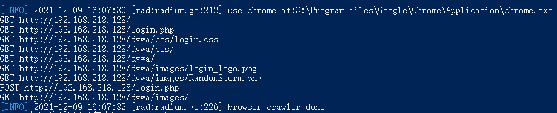
     
      - 添加不想被爬的路径：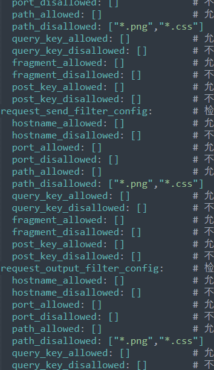
     
      - 修改后的爬取结果：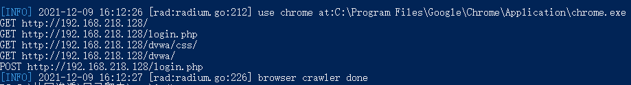

## 七、输出文件的使用

Rad有三种输出模式，简易输出，全输出和Json输出，此处大概提一下一些简单的使用，也欢迎师傅们有更多更好的想法。

1.  当使用`--text 1.txt`也就是简易输出的时候，可以选择将输出的文件中的GET与POST去掉，然后直接将该文件交给sqlmap来跑 
   - 当生成的txt比较大，或者是批量目标生成的txt合起来，就可以使用这样的命令进行批量检测`python sqlmap.py -m 1.txt --smart --batch --random-agent --level 5`

2. 上述的使用容易出现POST请求不会被检测到的情况，所以可以使用Json格式进行输出，然后通过脚本实现对GET请求与POST请求的分离，使用多命令执行来实现精准匹配。
   ```python
   import argparse
   import time
   import json
   import base64
   
   parser = argparse.ArgumentParser()
   txtName = str(int(time.time())) + ".txt"
   parser.add_argument('-r',help='Enter the file you want to generate')
   parser.add_argument('-o', type=str, default=txtName, help='Please enter the name of the file you want to output. Default is '+txtName)
   args = parser.parse_args()
   f = open(args.r,'r')
   load_dict = json.load(f)
   f.close()
   a = ""
   for i in range(len(load_dict)):
       if load_dict[i]["Method"] == "GET":
           a += "; python sqlmap.py -u \"{}\" --smart --batch --random-agent --level 5".format(load_dict[i]["URL"])
       else:
           if "b64_body" in load_dict[i]:
               a += "; python sqlmap.py -u \"{}\" --data \"{}\" --smart --batch --random-agent --level 5".format(load_dict[i]["URL"],base64.b64decode(load_dict[i]["b64_body"]).decode("utf-8"))
           else:
               continue
   f = open(args.o,"w")
   f.write(a)
   f.close()
   ```
   - 该脚本只是实例，可根据自己需求自行修改。
   - 效果如下，为方便展示，将分号替换为回车：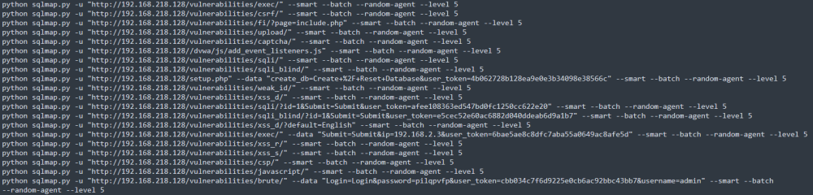
