## 为什么我们需要反连平台
在进行漏洞检测的时候，我们会发现有很多的漏洞在执行了一些命令后，从表面上看没有任何回应的，比如命令执行漏洞，可以让目标执行读取文件的命令等，但由于前端并没有对应的展示，导致我们并不能知道文件是否成功读取，也就不知道命令是否执行成功。同时还有向经典的log4j rce，fastjson，ssrf等，都是没有回显的漏洞，那么当面对这类的漏洞，我们就需要一个反连平台，通过让目标执行`ping`、`curl`等命令，对反连平台发起请求，反连平台在接受到请求后，就能告诉我们，命令触发了，也就代表了漏洞存在了。
所以当我们想要比较完备的对一个系统进行测试，反连平台的利用一定是必不可少的。所以本文将着重讲述xray的反连平台如何部署搭建，配置文件如何修改，如何进行调试，并使用实际存在的漏洞进行举例。
### 视频教程

[如何部署反连平台并编写POC](https://www.bilibili.com/video/BV1ED4y1v7NK)

## 准备工作
### 云服务器
#### Ubuntu 20.04
安全策略：开启反连平台对外端口，开启53端口（UDP协议）
也就是修改安全组策略，将53端口开放，⚠️**注意**，协议类型一定要是**UDP**

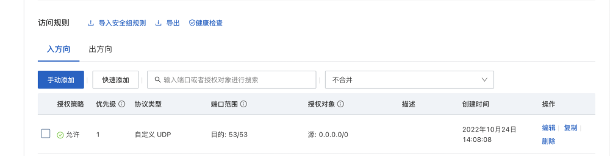

然后将需要对外开放的，部署反连平台的端口进行开放，比如8777，⚠️**注意**，该端口的协议类型是**TCP**

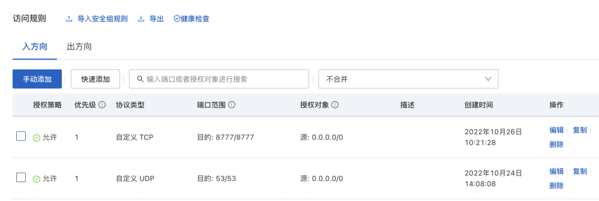

##### 解决53端口被systemd-resolve占用的问题
首先使用以下命令确认端口占用情况
`sudo netstat -nultp`
在确认被占用后，可以执行如下命令停用systemd-resolved
`sudo systemctl stop systemd-resolved`
编辑resolved.conf
`sudo vim /etc/systemd/resolved.conf`
将文件中的对应内容改为如下内容
```yaml
[Resolve]
DNS=x.x.x.x         #取消注释，增加dns，此处的值可以填写你的云服务器公网IP
#FallbackDNS=
#Domains=
#LLMNR=no
#MulticastDNS=no
#DNSSEC=no
#DNSOverTLS=no
#Cache=no-negative
DNSStubListener=no    #取消注释，把yes改为no
#ReadEtcHosts=yes
```
修改完成后运行如下命令即可解除占用
`sudo ln -sf /run/systemd/resolve/resolv.conf /etc/resolv.conf`
### 域名
**以下的ip请替换为准备好的云服务器的公网ip**

1. 仅配置如图所示的内容：

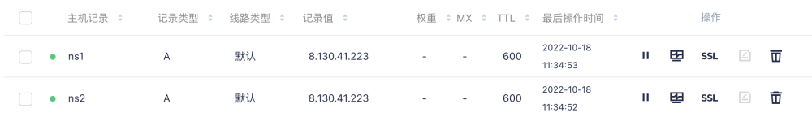

不做其他任何变动，同时配置文件填写好，在启动后，**支持http/rmi的反连**，dns**仅支持**在使用**dig**或者**nslookup**时，**指定IP解析**的情况下，接收到请求。
也就是说，**执行ping/curl命令时**，反连平台并**没有**办法收到dns解析记录。
如果想要让反连平台的dns功能也正常工作，应进行如下操作：
#### 腾讯云

1. 自定义DNS Host

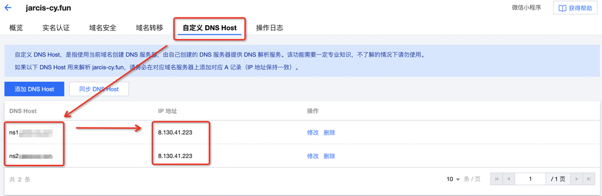

2. 修改域名的DNS解析

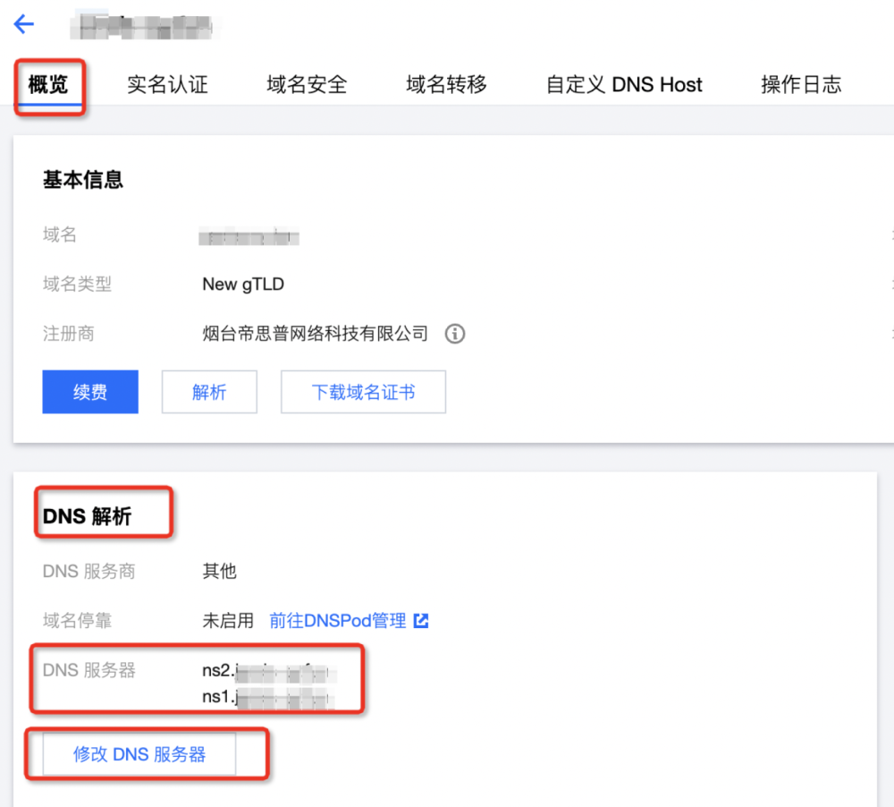

3. 修改完成后，需要10分钟到几小时不等的时间生效，时间越久，部署效果越好
#### 阿里云

1. 自定义DNS Host

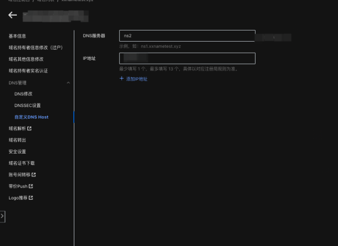
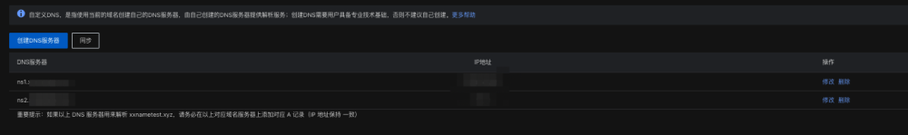

2. 修改域名的DNS解析

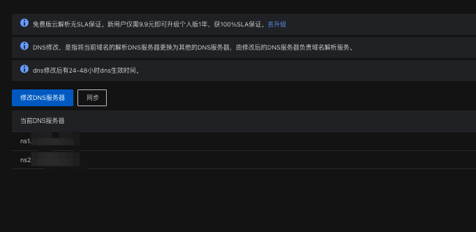

### 新版本xray
请前往CT stack下载最新版xray：[下载地址](https://stack.chaitin.com/tool/detail?id=1)

## 开始部署
连接上远程服务器，处理完53端口占用问题，上传最新版的xray，并运行一下生成配置文件，反连平台部分按照以下进行修改

### 非独立远程服务端
**以下的ip请替换为准备好的云服务器的公网ip**

**⚠️注意：当前版本非独立远程服务端的部署，在添加了DNS后，被动代理模式会出现无法扫描的BUG，建议暂时使用独立远程服务端进行部署**

```yaml
# 反连平台配置，更多解释见 https://docs.xray.cool/#/configration/reverse
# 注意: 默认配置为禁用反连平台，这是无法扫描出依赖反连平台的漏洞，这些漏洞包括 fastjson，ssrf 以及 poc 中依赖反连的情况等
reverse:
  db_file_path: "test.db"        # 反连平台数据库文件位置, 这是一个 KV 数据库
  token: ""                      # 反连平台认证的 Token, 独立部署时不能为空
  http:
    enabled: true
    listen_ip: 0.0.0.0 
    listen_port: "8777"
    ip_header: ""                # 在哪个 http header 中取 ip，为空代表从 REMOTE_ADDR 中取
  dns:
    enabled: true
    listen_ip: 0.0.0.0 
    domain: "xxxxx.com"      # 此处填写刚才准备好的域名，如果没有准备启动dns，没有准备域名，请不要填写
    is_domain_name_server: true        # 是否修改了域名的 ns 为反连平台，如果是，那 nslookup 等就不需要指定 dns 了
    resolve:                            # DNS 静态解析规则
    - type: A                           # A, AAAA, TXT 三种
      record: localhost
      value: 127.0.0.1
      ttl: 60
  client:
    remote_server: false                # 是否是独立的远程 server，如果是要在下面配置好远程的服务端地址
    http_base_url: "http://8.130.41.223:8777"                   # 默认将根据 ListenIP 和 ListenPort 生成，该地址是存在漏洞的目标反连回来的地址, 当反连平台前面有反代、绑定域名、端口映射时需要自行配置
    dns_server_ip: "8.130.41.223"                   # 和 http_base_url 类似，实际用来访问 dns 服务器的地址
    # 如果没有准备启动dns，没有准备域名，请不要填写
```
### 独立远程服务端
**以下配置文件中的ip请替换为云服务器对应的公网ip**
#### 服务端
```yaml
# 反连平台配置，更多解释见 https://docs.xray.cool/#/configration/reverse
# 注意: 默认配置为禁用反连平台，这是无法扫描出依赖反连平台的漏洞，这些漏洞包括 fastjson，ssrf 以及 poc 中依赖反连的情况等
reverse:
  db_file_path: "test.db"        # 反连平台数据库文件位置, 这是一个 KV 数据库
  token: "xxxxx"                      # 反连平台认证的 Token, 独立部署时不能为空
  http:
    enabled: true
    listen_ip: 0.0.0.0 
    listen_port: "8777"
    ip_header: ""                # 在哪个 http header 中取 ip，为空代表从 REMOTE_ADDR 中取
  dns:
    enabled: true
    listen_ip: 0.0.0.0 
    domain: "xxxxx.com"      # 此处填写刚才准备好的域名，如果没有准备启动dns，没有准备域名，请不要填写
    is_domain_name_server: true        # 是否修改了域名的 ns 为反连平台，如果是，那 nslookup 等就不需要指定 dns 了
    resolve:                            # DNS 静态解析规则
    - type: A                           # A, AAAA, TXT 三种
      record: localhost
      value: 127.0.0.1
      ttl: 60
  client:
    remote_server: false                # 是否是独立的远程 server，如果是要在下面配置好远程的服务端地址
    http_base_url: "http://8.130.41.223:8777"                   # 默认将根据 ListenIP 和 ListenPort 生成，该地址是存在漏洞的目标反连回来的地址, 当反连平台前面有反代、绑定域名、端口映射时需要自行配置
    dns_server_ip: "8.130.41.223"                   # 和 http_base_url 类似，实际用来访问 dns 服务器的地址
    # 如果没有准备启动dns，没有准备域名，请不要填写
```
#### 客户端
```yaml
# 反连平台配置，更多解释见 https://docs.xray.cool/#/configration/reverse
# 注意: 默认配置为禁用反连平台，这是无法扫描出依赖反连平台的漏洞，这些漏洞包括 fastjson，ssrf 以及 poc 中依赖反连的情况等
reverse:
  db_file_path: ""        # 反连平台数据库文件位置, 这是一个 KV 数据库
  token: "xxxxx"                      # 反连平台认证的 Token, 独立部署时不能为空
  http:
    enabled: false
    listen_ip: 0.0.0.0 
    listen_port: "8777"
    ip_header: ""                # 在哪个 http header 中取 ip，为空代表从 REMOTE_ADDR 中取
  dns:
    enabled: false
    listen_ip: 0.0.0.0 
    domain: "xxxxx.com"      # 此处填写刚才准备好的域名，如果没有准备启动dns，没有准备域名，请不要填写
    is_domain_name_server: false        # 是否修改了域名的 ns 为反连平台，如果是，那 nslookup 等就不需要指定 dns 了
    resolve:                            # DNS 静态解析规则
    - type: A                           # A, AAAA, TXT 三种
      record: localhost
      value: 127.0.0.1
      ttl: 60
  client:
    remote_server: true                # 是否是独立的远程 server，如果是要在下面配置好远程的服务端地址
    http_base_url: "http://8.130.41.223:8777"                   # 默认将根据 ListenIP 和 ListenPort 生成，该地址是存在漏洞的目标反连回来的地址, 当反连平台前面有反代、绑定域名、端口映射时需要自行配置
    dns_server_ip: "8.130.41.223"                   # 和 http_base_url 类似，实际用来访问 dns 服务器的地址
    # 如果没有准备启动dns，没有准备域名，请不要填写
```
## 使用方式
### 非独立远程服务端

1. 将xray放置于存在公网ip的服务器上，并按照上述进行配置。
2. 配置完成后，直接在该服务器上进行操作，反连将可以正常运行
### 独立远程服务端

1. 将xray放置于存在公网ip的服务器上，并按照上述进行配置。
2. 安装screen，并使用screen创建一个新的视窗，并将反连平台运行在新的视窗中，这样在退出ssh连接后，反连平台将一直保持运行，操作如下
```yaml
apt update
apt install screen
screen -R reverse
```

3. 这样将进入到名为reverse的视窗中，执行`./xray reverse`启动反连平台，可以输入exit退出视窗
4. 使用screen -ls可以查看当前存在的视窗，并使用screen -r {{id}} 进入视窗
5. 然后在本地将客户端的配置配置好，启动客户端即可。
## 生效测试
在服务端启动一个xray reverse，应该能看到这样的界面：

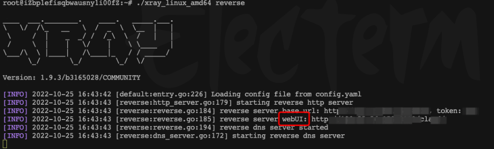

访问webUI后的链接即可访问到反连平台：
#### HTTP

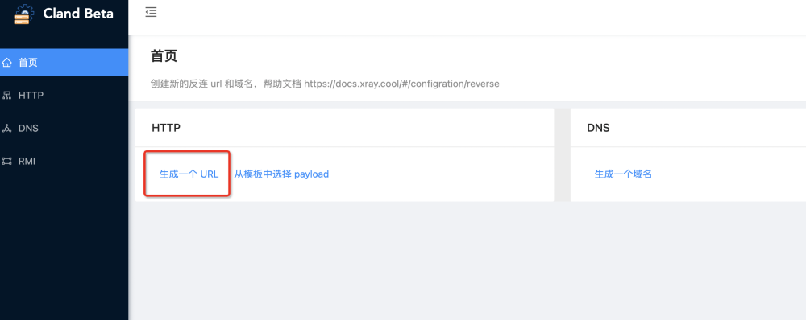
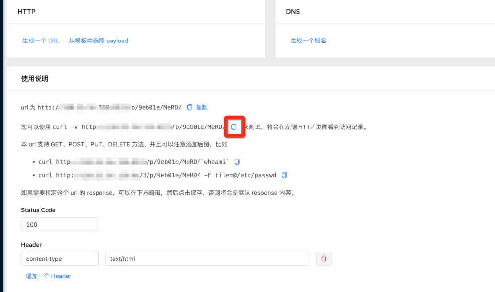

点击复制后，到命令行中执行

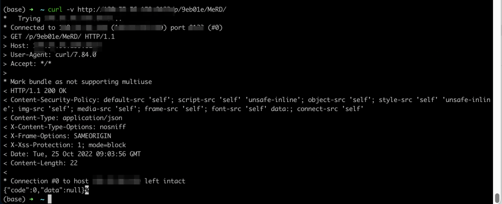

可以看到存在返回，同时查看服务端那边的信息，可以看到：

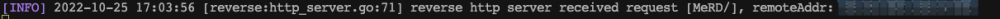
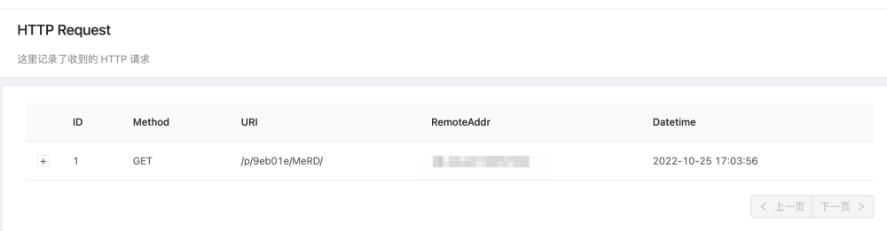

#### DNS

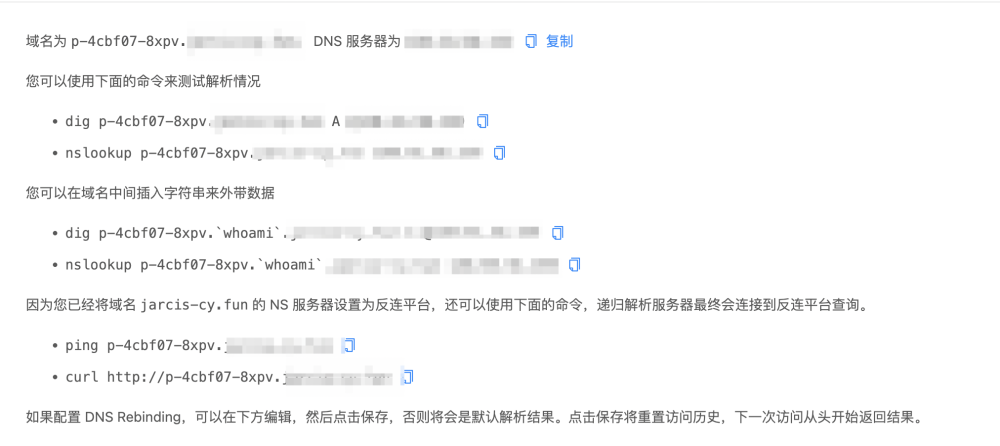

如果是刚部署好，可以首先使用nslookup进行测试

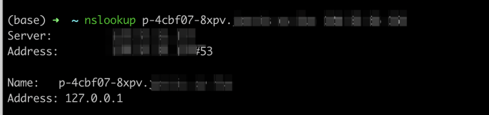
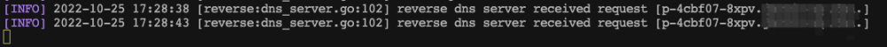

如果已经有一段时间了，则可以使用ping命令

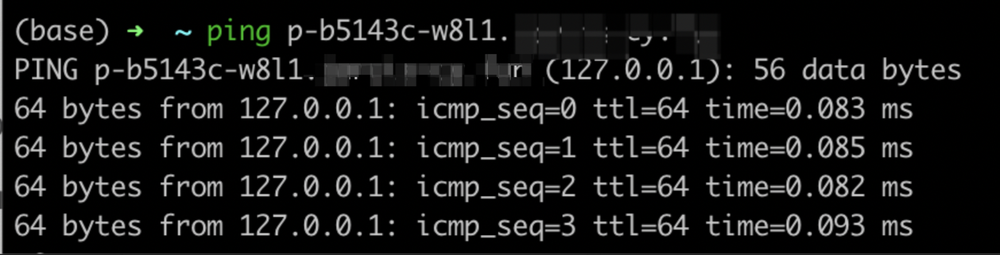
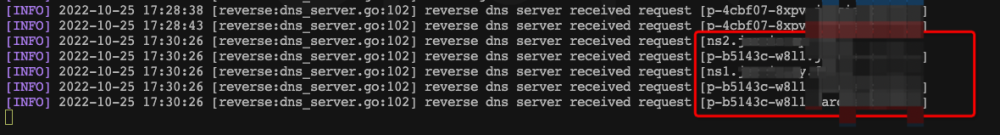

之所以能接收到解析，是因为此时已经将这个机器设置成了这个域名的dns服务器，那么当别人去请求这些生成的域名的时候，dns查询请求就会到这个服务器上，那么这个时候我们就能知道，有人正在查询对应的域名，从而可以证明poc被触发。
**注：**为了使得反连平台的可读性，它只会记录固定规则生成的链接的信息
例如上图中有7个dns请求，在反连平台中就只会显示5个，ns1，ns2的那个并不会被记录下来

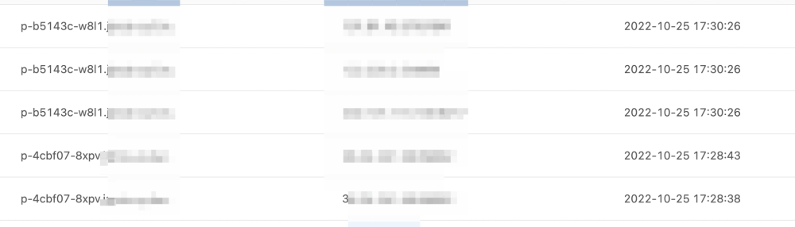

## 插件测试
以下测试考虑到大部分人的情况，将一律采用客户端+服务端的形式进行测试，同时在客户端上挂一个burp进行抓包查看详细的发包细节
### log4j插件测试
靶场：vulfocus上的log4j的第一个靶场做测试
命令：`./xray_darwin_arm64 ws --poc poc-go-apache-log4j2-rce --basic [http://123.58.224.8:32750](http://123.58.224.8:32750)`

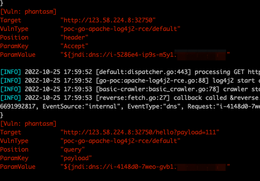
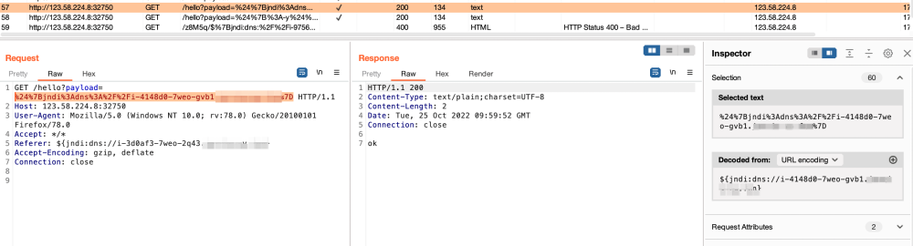

该插件默认使用dns进行检测，如果想不用dns进行检测，可以在配置文件中，将domain置空，同时将dns_server_ip置空。

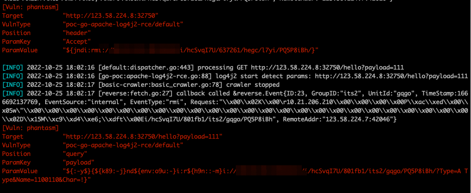
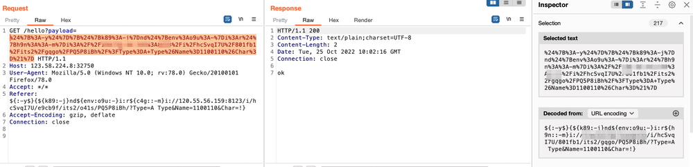

### fastjson
靶场：vulfocus的fastjson 代码执行 （CNVD-2019-22238）
命令：`./xray_darwin_arm64 ws --plug fastjson --url [http://123.58.224.8:52772](http://123.58.224.8:52772)`

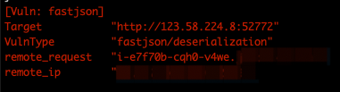

## 常见问题排查

1. 本地客户端报错，连接不上服务端的反连平台
   1. 请检查客户端与服务端是否可以正常通信
   2. 请检查客户端与服务端的token是否一致
   3. 请检查客户端与服务端使用的xray版本是否一致
   4. 请检查客户端与服务端所写的端口是否一致
   5. 请检查服务端存在的云服务器的对应端口是否开放（安全组策略，iptables，端口占用等）
2. DNS反连无法使用
   1. 请检查域名配置是否正确，是否已经设置dns host，自定义dns解析服务器
   2. 请检查客户端与服务端的配置文件中的域名填写正确
