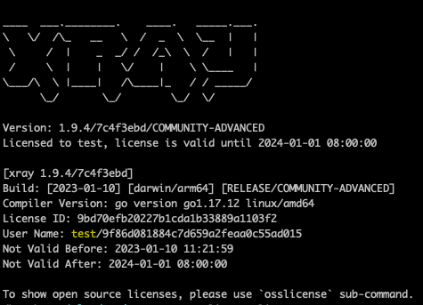

# 下载运行

xray 为单文件二进制文件，无依赖，也无需安装，下载后直接使用。

## 下载地址

请下载的时候选择最新的版本下载。

+ Github: https://github.com/chaitin/xray/releases （国外速度快）
+ 网盘: https://yunpan.360.cn/surl_y3Gu6cugi8u （国内速度快）

> 注意： 不要直接 clone 仓库，xray 并不开源，仓库内不含源代码，直接下载构建的二进制文件即可。

xray 跨平台支持，请下载时选择需要的版本下载。

<!-- tabs:start -->

#### ** Windows **

+ `windows_amd64` Windows x64
+ `windows_386` Windows x86

系统版本要求大于等于 Windows 7 或大于等于 Windows Server 2008 R2, 不支持 Windows XP、Windows 2003 等低版本系统。

#### ** MacOS **

+ `darwin_amd64` MacOS

支持的系统版本为大于等于 10.10

#### ** Linux **

+ `linux_amd64` Linux x64
+ `linux_386` Linux x86

要求内核版本大于等于 2.6.23。不支持 CentOS 5, 因为内核太旧了 （2.6.18)。

<!-- tabs:end -->

对于 release 中的其他文件，说明如下:

+ `sha256.txt` 校验文件，内含个版本的 sha256 的哈希值，请下载后自行校验以防被劫持投毒。
+ `Source Code` Github 自动打包的，无意义，请忽略。

## 运行

下载对应系统的版本后，来查看下 xray 的版本号。

<!-- tabs:start -->

#### ** Windows **

以下载到 `C:\Users\$User\Downloads` 为例，右键解压，就可以得到 `xray_windows_amd64.exe` 文件了（有的解压软件还会创建一个 `xray_windows_amd64.exe` 的文件夹，不要和最终的可执行文件混淆了）。

使用桌面左下方的的搜索框，输入 `PowerShell`，点击 `Windows PowerShell`，进入命令终端。

然后 `cd` 到下载目录，运行 `.\xray_windows_amd64.exe version` 即可查看 xray 的版本号。

#### ** MacOS **

以下载到 `~/Downloads` 为例，双击解压，就可以得到 `xray_darwin_amd64` 文件了。

打开使用的终端工具，比如 `Terminal` 或者 `iTerm`

然后 `cd` 到下载目录，运行 `./xray_darwin_amd64 version` 即可查看 xray 的版本号。

#### ** Linux **

以下载到 `~/xray` 为例，使用 `unzip` 命令解压，就可以得到 `xray_linux_amd64` 文件了。

然后运行 `./xray_linux_amd64 version` 即可查看 xray 的版本号。

<!-- tabs:end -->

## 高级版使用

### 获取途径

1. 金币兑换：在CT stack社区贡献PoC获得金币，可用于兑换xray高级版；
2. 活动抽奖：关注CT stack公众号/长亭科技公众号/b站等平台，不定时将会有活动赠送或抽取xray高级版；
3. 商业销售：有采购需求的师傅可以联系微信客服进行xray高级版询价；

### 使用方式

1. 将获取到的license文件放置到与xray的同级目录下即可生效
    
    ⚠️ 注意，license文件的名称必须是`xray-license.lic`才会生效

2. 生效后，再次启动xray时，将会在banner上看到xray的高级版信息，以及到期时间

   